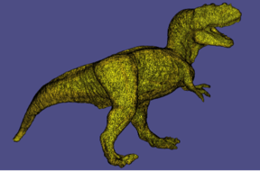
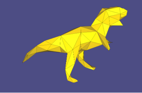

## sxqslim : Self-intersection free mesh simplification with QEM
 
- using libigl, AABB tree (https://github.com/lohedges/aabbcc)
- add self intersection test using aabb tree for every iteration
- Input : Manifold, self-intersection free mesh, Output : Decimated Manifold, self-intersection free mesh
## Compile

Compile this project using the standard cmake routine:
```angular2html
cd qslim
git submodule add https://github.com/libigl/libigl.git external/libigl
git submodule update --init --recursive
pip install -e .
```

## Run

From within the `build` directory just issue:

    python example.py

If you set ratio as 0.3, only 30% of vertices will be remained.<br/>
A glfw app should launch displaying a 3D cube.

## Reference
Surface Simplification Using Quadric Error Metrics, 1997 </br>
https://www.cs.cmu.edu/~./garland/Papers/quadrics.pdf